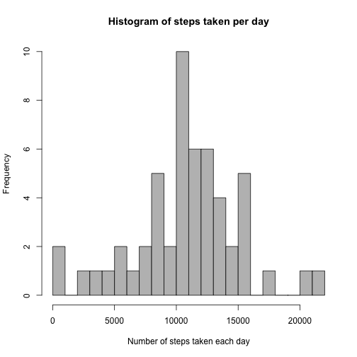
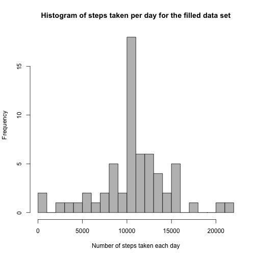

# Reproducible Research: Peer Assessment 1

## Loading and preprocessing the data

In this section the data is loaded. The repository contains `activity.zip`
archive file containing the data file `activity.csv`. We unzip the archive file,
load the CSV data file, and preprocess it.


```r
unzip("activity.zip")
data <- read.csv("activity.csv", stringsAsFactors = FALSE)
data$date <- strptime(data$date, "%Y-%m-%d")
```


## What is mean total number of steps taken per day?

A histogram of the total number of steps taken each day


```r
steps.per.day <- tapply(data$steps, as.Date(data$date), sum)
hist(steps.per.day, breaks = 25, col = "grey", xlab = "Number of steps taken each day", 
    ylab = "Frequency", main = "Histogram of steps taken per day")
```

 


The mean and the median of the total number of steps taken each day are:


```r
mean(steps.per.day, na.rm = TRUE)
```

```
## [1] 10766
```

```r
median(steps.per.day, na.rm = TRUE)
```

```
## [1] 10765
```


## What is the average daily activity pattern?

The plot shows the average number of steps taken at each interval during the
day.


```r
steps.per.interval <- tapply(data$steps, data$interval, mean, na.rm = TRUE)
intervals <- unique(data$interval)
plot(intervals, steps.per.interval, type = "l", xlab = "Interval", ylab = "Number of steps", 
    main = "Average number of steps per interval")
```

 


The interval that contains the maximum average number of steps across all the
days is:


```r
intervals[which.max(steps.per.interval)]
```

```
## [1] 835
```


## Imputing missing values

The number of rows containing missing values (i.e. `NA`) is:


```r
sum(is.na(data$steps))
```

```
## [1] 2304
```


In order to deal with missing values we propose to substitute `NA` with
an average value of the corresponding interval across all the days.
(We've calculated the average number of steps per interval in previous section).

We have to create the new data set with all `NA` values substituted:


```r
steps <- data$steps
na.steps <- is.na(steps)
# For each missing step we take it's corresponding interval, and substitute
# the missing value by the average number of steps across all days of this
# interval
steps[na.steps] <- steps.per.interval[as.character(data$interval[na.steps])]
names(steps) <- c()
filled.data <- data.frame(steps = steps, date = data$date, interval = data$interval)
```


A histogram of the total number of steps taken each day for the new data set is:


```r
steps.per.day.filled <- tapply(filled.data$steps, as.Date(filled.data$date), 
    sum)
hist(steps.per.day.filled, breaks = 25, col = "grey", xlab = "Number of steps taken each day", 
    ylab = "Frequency", main = "Histogram of steps taken per day for the filled data set")
```

 


The mean and the median of the total number of steps taken each day for the new
data set are:


```r
mean(steps.per.day.filled)
```

```
## [1] 10766
```

```r
median(steps.per.day.filled)
```

```
## [1] 10766
```


The difference in values of median and mean of the 2 data sets:

data set | mean | median
---------|-----:|------:
original | 1.0766 &times; 10<sup>4</sup> | 10765
new      | 1.0766 &times; 10<sup>4</sup> | 1.0766 &times; 10<sup>4</sup>

As we can see the mean has not changed. The missing values were replaced by
the corresponding mean values, and the days in the original data set either
have all the measurements or have no measurements. Hence the number of steps for
such each day in the new data set is exactly the mean of the original data set.
Hence there is no change in the mean value.

The median has shifted towards the median due to the same reason:
the frequency of mean value has greatly increased.

## Are there differences in activity patterns between weekdays and weekends?

In this section a new categorical variable `day` with 2 levels `weekday` and
`weekend` is created. The variable indicates whether a given day is a weekend
or a working day.


```r
date.weekdays <- weekdays(filled.data$date)
date.weekend <- date.weekdays == "Sunday" | date.weekdays == "Saturday"
filled.data$day <- factor(as.integer(date.weekend), levels = c(0, 1), labels = c("weekday", 
    "weekend"))
```


The plot below shows the 5-minute interval (x-axis) and the average number of
steps taken averaged across all weekday days and weekend days (y-axis).


```r
library("lattice")
data.aggregated <- aggregate(steps ~ interval + day, mean, data = filled.data)
xyplot(steps ~ interval | day, data = data.aggregated, xlab = "Interval", ylab = "Number of steps", 
    type = "l", layout = c(1, 2))
```

 

